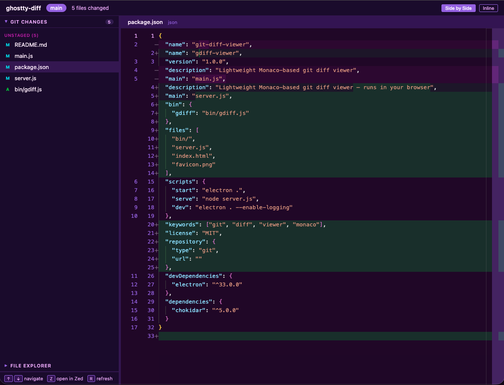

# gdiff-viewer

Lightweight git diff viewer using Monaco's diff editor — VS Code's diff view in your browser. No build step, no heavy dependencies.



## Quick Start

```bash
npx gdiff-viewer            # diff the current repo
npx gdiff-viewer /path/to/repo  # diff a specific repo or worktree
```

Starts a local server and opens your default browser.

## Features

- **Monaco diff editor** with full syntax highlighting
- **Side-by-side** or **inline** diff modes
- **Stage / unstage / discard** directly from the UI
- **File explorer** sidebar with tree view
- **Auto-refresh** — watches tracked files and git index for changes
- **Keyboard navigation**: Arrow keys to browse, R to refresh
- **Multi-repo** — open other repos via `?repo=/path` query param
- **Worktree-friendly** — pass any path, it resolves to the git root
- Works on **macOS, Windows, and Linux**

## Install Globally (optional)

```bash
npm install -g gdiff-viewer
gdiff /path/to/repo
```

## Architecture

No build step — Monaco loads from CDN.

| File | Purpose |
|------|---------|
| `bin/gdiff.js` | CLI entry point — starts server, opens browser |
| `server.js` | HTTP API — git commands, file serving, SSE file watcher |
| `index.html` | UI + Monaco diff editor |

## Worktree Usage

Works great with git worktrees:

```bash
npx gdiff-viewer ~/repos/project-feature-xyz
npx gdiff-viewer ~/repos/project-main
```

## Electron App (optional)

If you prefer a standalone desktop window instead of the browser, clone the repo and run with Electron:

```bash
git clone https://github.com/YOUR_USERNAME/gdiff-viewer.git
cd gdiff-viewer
npm install
npm start                        # diff the current directory
npx electron . /path/to/repo    # diff a specific repo
```

You can also use the included launcher script:

```bash
./launch.sh /path/to/repo
```
