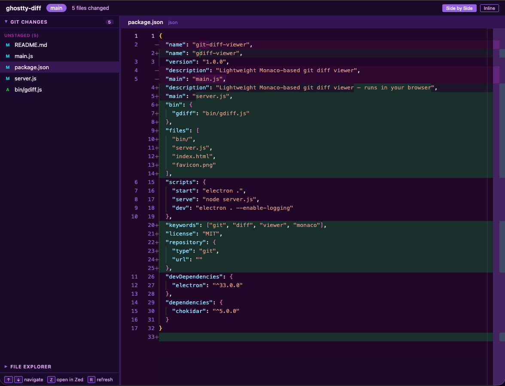

# gdiff

Native git diff viewer. Side-by-side or inline, stage/unstage/discard from the UI, syntax highlighting, 326 bundled themes.

No browser. No Electron. One binary.



## Quick start

```bash
cargo run --release -- /path/to/repo
# or after install:
gdiff                          # current directory
gdiff /path/to/repo            # any worktree; resolves to the git root
```

Requires `git` on `PATH`.

## Features

- Native window (egui), not a Chrome `--app` wrapper
- Side-by-side or inline diff with syntax highlighting
- Stage / unstage / discard from the file list
- File explorer sidebar
- Auto-refresh — watches the worktree and `.git`
- Keyboard: arrows to browse, `Z` open in editor, `R` refresh
- Type or drag-drop a folder to switch repo
- Theme picker — Ghostty Purple, GitHub Dark, plus 326 JetBrains/rainglow schemes
- Configurable editor for `Z` (Zed on macOS, Notepad on Windows)
- Worktree-friendly

## Install

```bash
cargo install --path .
```

### Prebuilt targets

| OS | Arch | Target triple |
|----|------|----------------|
| macOS | arm64 | `aarch64-apple-darwin` |
| Windows | amd64 | `x86_64-pc-windows-msvc` |

```bash
# macOS Apple Silicon
cargo build --release --target aarch64-apple-darwin

# Windows x64 (on Windows, or via the GitHub Actions workflow)
cargo build --release --target x86_64-pc-windows-msvc
```

CI (`.github/workflows/build.yml`) builds both and uploads the binaries as artifacts. Linking `x86_64-pc-windows-msvc` from macOS is not supported; use the Windows job.

## Configuration

User settings live in `~/.gdiff-viewer.json` — same file as the old JS app.

```json
{
  "theme": "absent",
  "editorCommand": "code {file}",
  "sideBySide": true
}
```

| Key | Default | Notes |
|-----|---------|-------|
| `theme` | `default` | Built-ins: `default`, `github-dark`. JetBrains ids are the XML filename (e.g. `absent`). |
| `editorCommand` | platform default below | `{file}` is replaced with the absolute path. |
| `sideBySide` | `true` | Last side-by-side / inline choice. |

Default `editorCommand`:

| Platform | Command |
|----------|---------|
| macOS | `open -a Zed {file}` |
| Windows | `notepad.exe {file}` |
| Linux | `xdg-open {file}` |

## Architecture

| Path | Purpose |
|------|---------|
| `src/main.rs` | CLI + native window |
| `src/app.rs` | UI, keyboard, worker jobs |
| `src/git.rs` | `git` porcelain: status, diff, stage, unstage, discard, tree |
| `src/diff_view.rs` | Line-aligned side-by-side / inline view |
| `src/highlight.rs` | syntect token coloring |
| `src/theme.rs` | Built-in + bundled rainglow chrome |
| `src/watcher.rs` | `notify` + debounce |
| `src/config.rs` | `~/.gdiff-viewer.json` |
| `themes.json` | 326 pre-extracted JetBrains color schemes |

Git is invoked as argv (not a shell string). Errors from `git show` still come back empty so new/deleted files work.

## License

MIT for the app. Bundled JetBrains color schemes are MIT — see `THEMES_LICENSE`.
